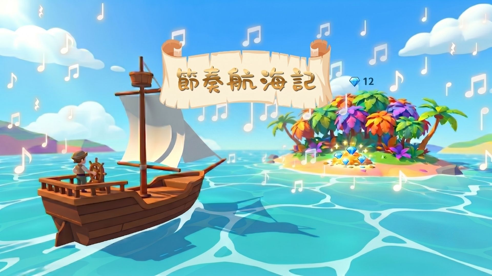

# 節奏航海記 Rhythm Ocean

一款以「航海尋寶」為主題的節奏教學互動網頁遊戲。老師可以快速建立節奏關卡，學生演奏正確就讓帆船航向寶島、獲得寶石；演奏錯誤則沉船後重新挑戰，讓課堂練習更有故事感與參與感。

## 線上體驗

- GitHub Pages：<https://linyubert.github.io/rhythm-ocean/>

## 功能特色

- 🌊 **海洋航行主題**：3D 海面、帆船、寶島與寶石動畫，提升課堂互動感。
- 🎵 **節奏關卡建立**：可手動組合四分音符、八分音符、休止符與小節線。
- 🎲 **隨機出題**：一鍵隨機產生 10 題節奏練習。
- ✅ **即時判定流程**：老師可按「演奏正確」或「演奏錯誤」控制遊戲進行。
- 💎 **獎勵回饋**：答對獲得寶石，完成所有關卡後顯示結算畫面。
- 🔊 **音效與環境音**：內建簡易互動音效，可調整音量或關閉環境音。
- 📱 **社群連結**：首頁提供 Threads 與 YouTube 連結。
- 🖼️ **分享縮圖**：已加入 Open Graph / Twitter Card 設定，分享網站連結時可顯示預覽圖。

## 使用方式

1. 開啟網站後點擊 **START**。
2. 在設定大廳建立節奏關卡：
   - 點擊音符按鈕手動組合節奏後，按 **加入關卡**。
   - 或按 **隨機產生 10 題** 快速建立題目。
3. 按 **開始陽光航行** 進入遊戲。
4. 學生依畫面節奏演奏。
5. 老師依表現點選：
   - **演奏正確**：帆船前進並獲得寶石。
   - **演奏錯誤**：船隻沉沒，可重新挑戰該關。
6. 完成所有關卡後顯示結算畫面。

## 技術說明

- HTML / CSS / JavaScript 單頁應用
- Three.js 3D 場景與動畫
- Web Audio API 音效與環境音
- GitHub Pages 靜態網站部署

## 作者

- Threads：[@lycbert](https://www.threads.com/@lycbert)
- YouTube：[@datoemusic](https://www.youtube.com/@datoemusic)

## 授權

此專案尚未設定授權條款。若要開放他人使用、修改或教學分享，建議新增 `LICENSE` 檔案，例如 MIT License。
